# pymaze

pymaze is a maze generation program written in Python 3. To use pymaze, download a precompiled [release](https://github.com/ClubiNew/pymaze/releases), or clone the repository and follow these steps:

1. Run `python3 -m pip install -r requirements.txt` to install the dependencies
2. Run `python3 main.py` and select the maze size, resolution, seed and algorithm to use
3. Preview and/or save the generated maze
    - Saved mazes will output to the `pymaze/out` directory

# Supported Algorithms

pymaze currently has four algorithms to choose from. Each algorithm produces stylistically unique results.

## 1. Prim's algorithm

Using a simplified and randomized version of [Prim's algorithm](https://en.wikipedia.org/wiki/Prim%27s_algorithm), you can generate a maze biased towards many short dead ends.

    
<b>Example Results</b>

    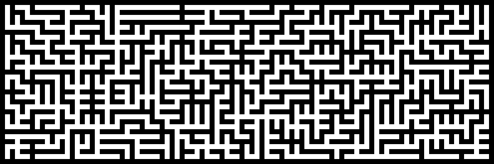
    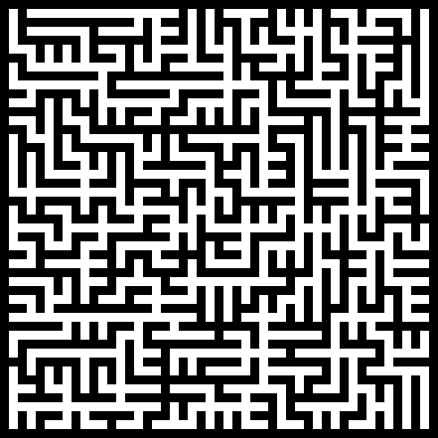
    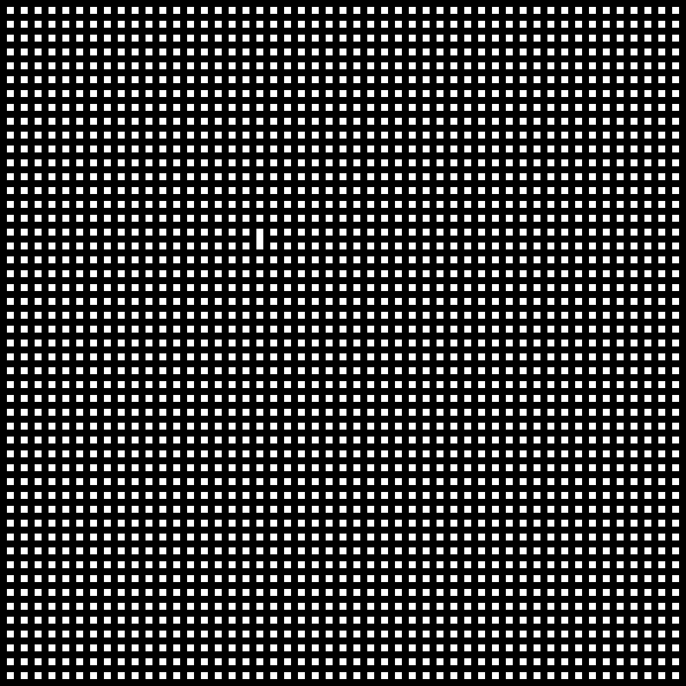

## 2. Randomized depth-first search

Using a randomized iterative depth-first search, you can generate a maze biased towards many long corridors.

    
<b>Example Results</b>

    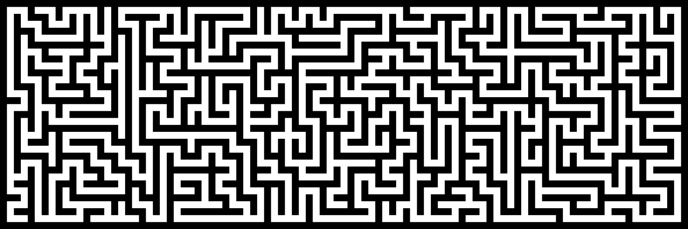
    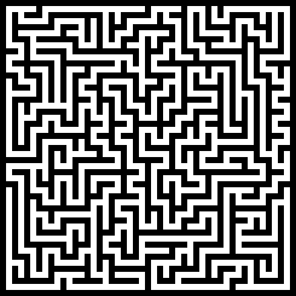
    

## 3. Wilson's algorithm

Using [loop-erased walks](https://en.wikipedia.org/wiki/Loop-erased_random_walk) with Wilson's algorithm, you can generate an unbiased maze from the [uniform distribution](https://en.wikipedia.org/wiki/Discrete_uniform_distribution) of all mazes.

    
<b>Example Results</b>

    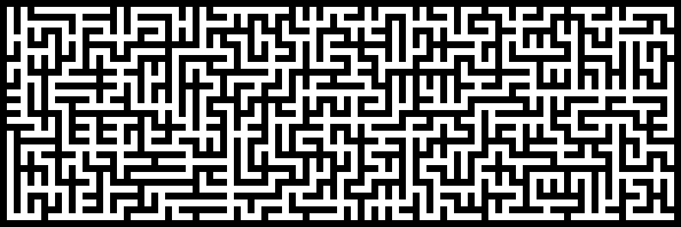
    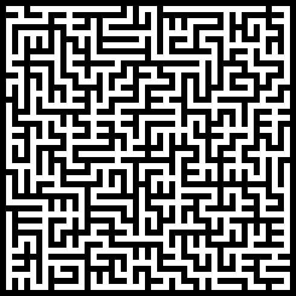
    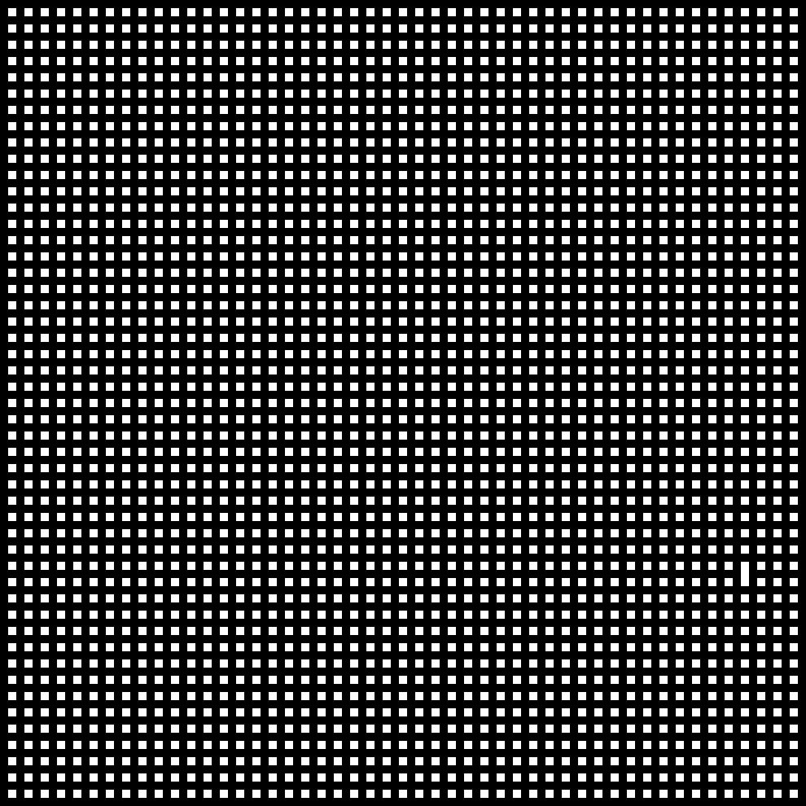

## 4. Recursive division

By recursively splitting the maze into smaller pieces using randomly placed walls with a randomly placed gap on them, you can generate mazes with very long walls.

    
<b>Example Results</b>

    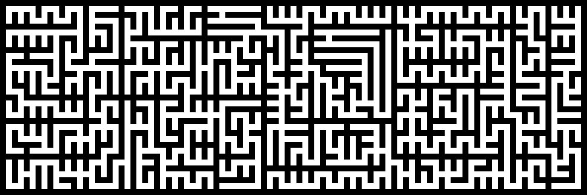
    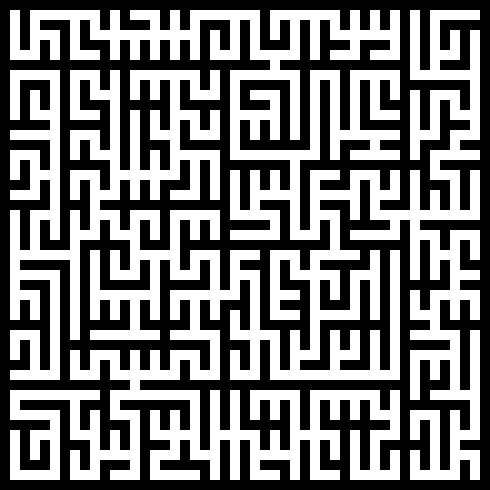
    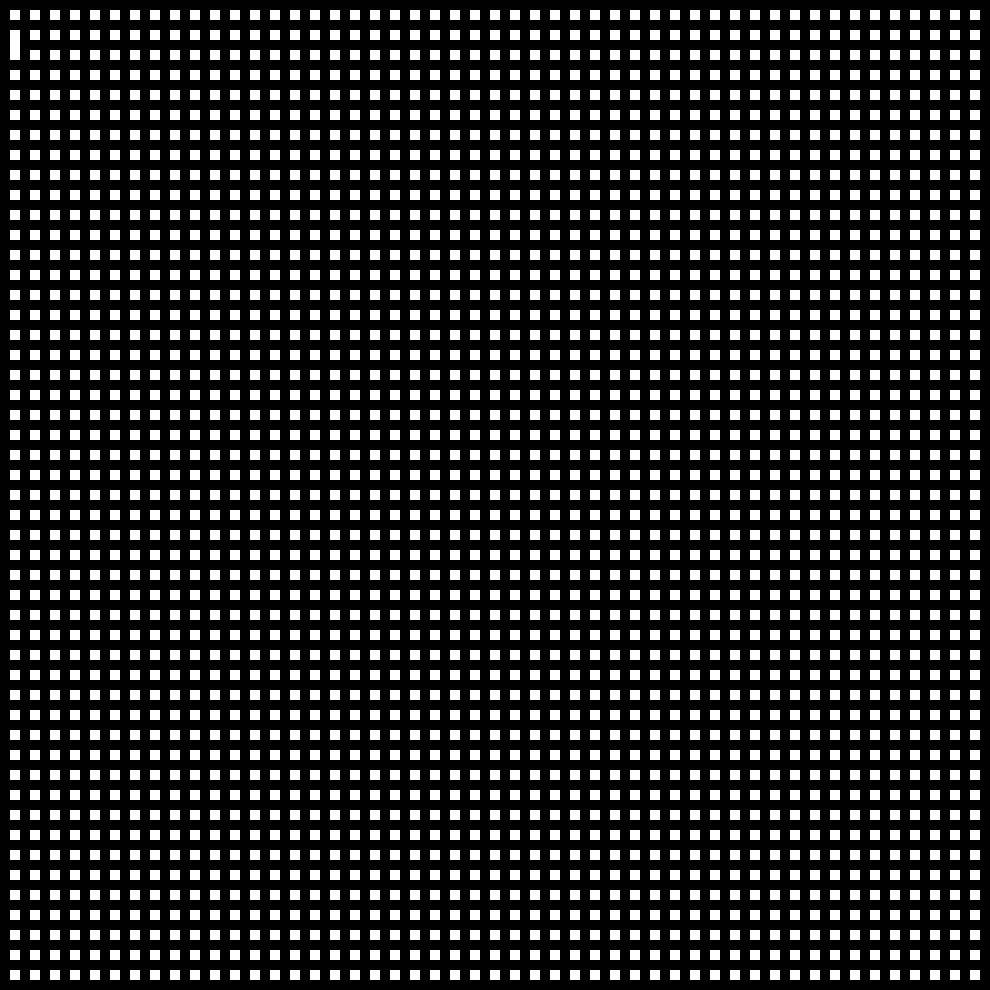

**_Note:_** All of the example mazes are generated with their extension-less file name (i.e. 99x33) as the seed, should you wish to re-create them.
