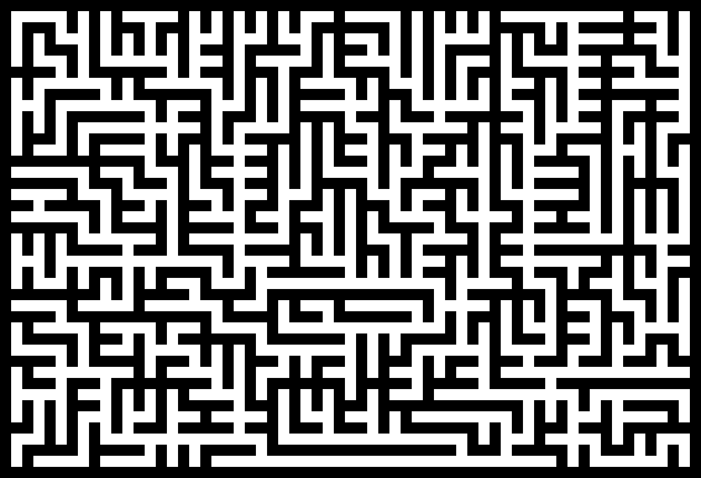
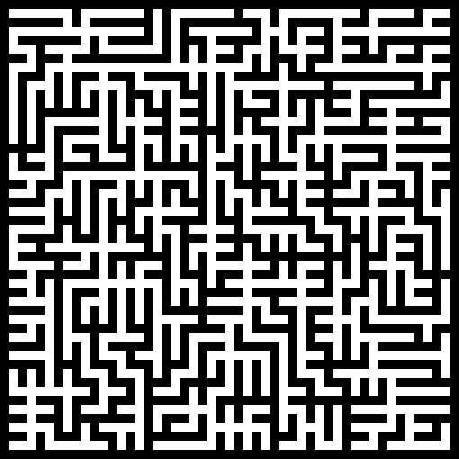

# pymaze

pymaze is a python programming for maze generation. simply run `main.py` and select the maze size, resolution, seed and algorithm to use. saved mazes will output to the `pymaze/out` directory.

# Supported Algorithms

pymaze currently has one algorithm to choose from. each algorithm produces stylistically unique results.

## 1. Prim's Algorithm

Using a simplified and randomized version of [Prim's algorithm](https://en.wikipedia.org/wiki/Prim%27s_algorithm), you can generate a maze biased towards many short dead ends.

    
<b>Example Results</b>

    
    

